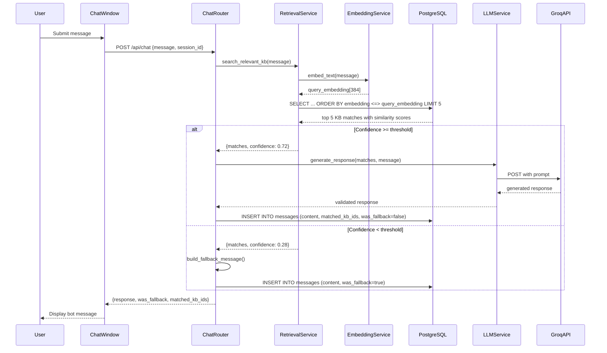
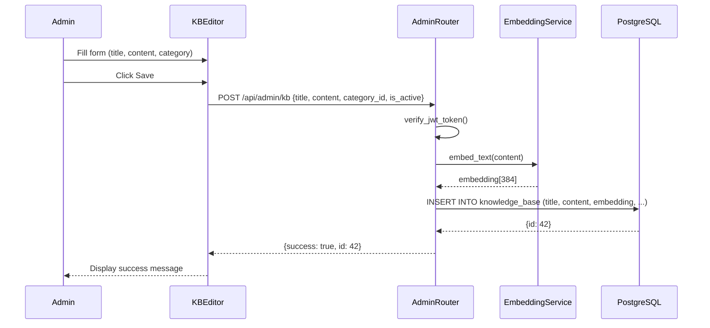
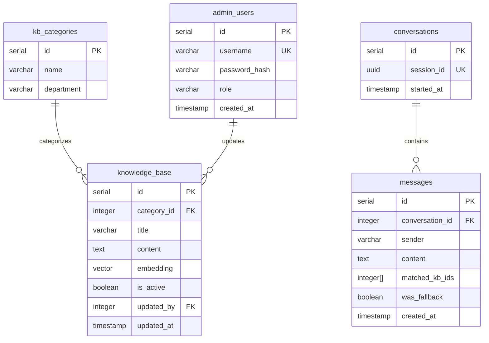
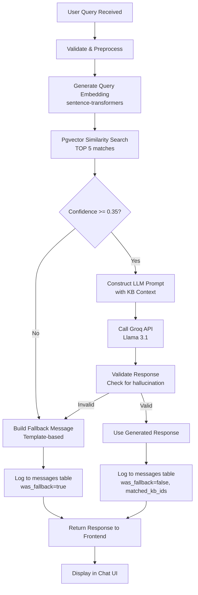
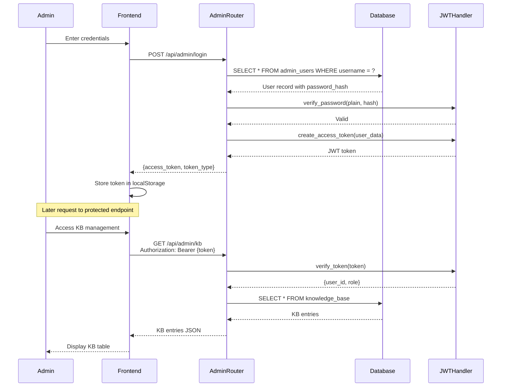

# Design Document

## Overview

ADMIT (Admissions & Inquiries Technology) is a web-based conversational AI assistant implementing Retrieval-Augmented Generation (RAG) to answer admissions and enrollment questions for SACLI (St. Anthony College of Ligao Inc.). The system serves two primary user types: public users (students, applicants, parents) who interact with a chat interface without authentication, and system administrators who manage the knowledge base through a JWT-protected dashboard.

The core architecture consists of three layers:

1. **Frontend Layer**: React-based single-page application with public chat interface and admin dashboard
2. **Backend Layer**: FastAPI-based REST API orchestrating RAG pipeline, authentication, and CRUD operations
3. **Data Layer**: PostgreSQL database with pgvector extension for semantic search

The system's defining characteristic is its RAG pipeline: user queries are embedded into vectors, matched against a knowledge base using semantic similarity search, and responses are generated by an LLM (Groq API with Llama 3.1) constrained to answer only from retrieved content. Queries below a confidence threshold trigger a graceful fallback mechanism that redirects users to appropriate SACLI offices, ensuring the system never fabricates information.

This design addresses the thesis requirement for "predefined knowledge base" constraint while maintaining natural conversational quality through LLM generation. All interactions are logged with metadata (matched KB entries, fallback flags, timestamps) to support ISO/IEC 25010 evaluation metrics for the thesis.

## Architecture

### System Architecture Diagram

```
┌─────────────────────────────────────────────────────────────────────────┐
│                         FRONTEND (React + Vite)                          │
│  ┌──────────────────────────┐     ┌──────────────────────────────────┐ │
│  │   Public Chat Interface   │     │      Admin Dashboard (JWT)        │ │
│  │  - ChatWindow             │     │  - Knowledge Base Management      │ │
│  │  - QuickReplyButtons      │     │  - Conversation Logs Viewer       │ │
│  │  - TypingIndicator        │     │  - Analytics Dashboard            │ │
│  └────────────┬─────────────┘     └──────────────┬───────────────────┘ │
└───────────────┼────────────────────────────────────┼────────────────────┘
                │ HTTPS/JSON (CORS-enabled)          │
┌───────────────▼────────────────────────────────────▼────────────────────┐
│                       BACKEND (FastAPI)                                  │
│  ┌──────────────────────────────────────────────────────────────────┐  │
│  │                        Chat Router (/api/chat)                        │  │
│  │  1. Receive user message                                            │  │
│  │  2. Call Retrieval Service → embed query → pgvector search         │  │
│  │  3. Confidence check → fallback or LLM generation                   │  │
│  │  4. Log interaction to messages table                               │  │
│  └──────────────────────────────┬───────────────────────────────────┘  │
│  ┌──────────────────────────────▼───────────────────────────────────┐  │
│  │                     Retrieval Service                              │  │
│  │  - Embedding Service (sentence-transformers: all-MiniLM-L6-v2)    │  │
│  │  - Pgvector similarity search (cosine distance)                    │  │
│  │  - Confidence scoring                                               │  │
│  └──────────────────────────────┬───────────────────────────────────┘  │
│  ┌──────────────────────────────▼───────────────────────────────────┐  │
│  │                        LLM Service                                  │  │
│  │  - Prompt construction with retrieved KB context                   │  │
│  │  - Groq API integration (Llama 3.1 8B/70B)                         │  │
│  │  - Response grounding validation                                    │  │
│  └────────────────────────────────────────────────────────────────────┘  │
│  ┌────────────────────────────────────────────────────────────────────┐  │
│  │               Admin Router (/api/admin/*) - JWT Protected          │  │
│  │  - KB CRUD operations (auto-embedding on create/update)            │  │
│  │  - Conversation logs retrieval with filters                         │  │
│  │  - Analytics computation (fallback rate, common queries)            │  │
│  └────────────────────────────┬───────────────────────────────────────┘  │
│  ┌──────────────────────────────▼───────────────────────────────────┐  │
│  │                    Authentication Service                           │  │
│  │  - JWT generation and validation                                    │  │
│  │  - bcrypt password hashing                                          │  │
│  └────────────────────────────────────────────────────────────────────┘  │
└───────────────────────────────┬──────────────────────────────────────────┘
                                │
┌───────────────────────────────▼──────────────────────────────────────────┐
│                   DATA LAYER (PostgreSQL + pgvector)                     │
│  ┌────────────────────┐  ┌────────────────────┐  ┌──────────────────┐  │
│  │  kb_categories     │  │  knowledge_base     │  │  admin_users     │  │
│  │  - id              │  │  - id               │  │  - id            │  │
│  │  - name            │  │  - category_id (FK) │  │  - username      │  │
│  │  - department      │  │  - title            │  │  - password_hash │  │
│  └────────────────────┘  │  - content          │  │  - role          │  │
│                           │  - embedding (vec)  │  │  - created_at    │  │
│                           │  - is_active        │  └──────────────────┘  │
│                           │  - updated_by (FK)  │                         │
│                           │  - updated_at       │                         │
│                           └────────────────────┘                         │
│  ┌────────────────────┐  ┌────────────────────┐                         │
│  │  conversations     │  │  messages           │                         │
│  │  - id              │  │  - id               │                         │
│  │  - session_id      │  │  - conversation_id  │                         │
│  │  - started_at      │  │  - sender           │                         │
│  └────────────────────┘  │  - content          │                         │
│                           │  - matched_kb_ids[] │                         │
│                           │  - was_fallback     │                         │
│                           │  - created_at       │                         │
│                           └────────────────────┘                         │
└──────────────────────────────────────────────────────────────────────────┘
                                │
┌───────────────────────────────▼──────────────────────────────────────────┐
│                    EXTERNAL SERVICES                                      │
│  ┌─────────────────────────────────────────────────────────────────┐    │
│  │  Groq API (Llama 3.1) - LLM Generation Service                   │    │
│  └─────────────────────────────────────────────────────────────────┘    │
└──────────────────────────────────────────────────────────────────────────┘
```


### Architectural Patterns

**Three-Tier Architecture**: Clear separation between presentation (React), business logic (FastAPI), and data (PostgreSQL) enables independent scaling and maintenance.

**Retrieval-Augmented Generation (RAG)**: Combines semantic search with LLM generation to produce accurate, grounded responses. This pattern addresses the "predefined knowledge base" constraint while maintaining conversational quality.

**Async I/O**: FastAPI's async capabilities handle concurrent LLM API calls and database operations efficiently, supporting the 10 concurrent requests performance requirement.

**Repository Pattern**: Database access is abstracted through service layer modules, allowing schema changes without affecting business logic.

**JWT Stateless Authentication**: Admin sessions are managed through JWT tokens, eliminating server-side session storage and enabling horizontal scaling.

## Components and Interfaces

### Frontend Components

#### Public Chat Interface Components

**ChatWindow Component**
- **Purpose**: Main container for chat interaction
- **State Management**: 
  - `messages`: Array of user/bot message objects
  - `isLoading`: Boolean for typing indicator
  - `sessionId`: UUID for conversation tracking
- **API Integration**: Calls `/api/chat` POST endpoint
- **Props**: None (root component for chat page)


**MessageBubble Component**
- **Purpose**: Render individual messages with sender-specific styling
- **Props**:
  - `sender`: "user" | "bot"
  - `content`: string (message text)
  - `timestamp`: Date
- **Styling**: TailwindCSS classes for alignment (user right, bot left) and color differentiation

**QuickReplyButtons Component**
- **Purpose**: Display category-based quick action buttons
- **Data Source**: `/api/quick-replies` GET endpoint
- **Props**:
  - `categories`: Array of { id, name, query }
  - `onSelect`: Callback function to submit query
- **Categories**: Admission Requirements, Enrollment Steps, Programs Offered, Tuition & Payment, Scholarships, Contact Info

**TypingIndicator Component**
- **Purpose**: Visual feedback during RAG pipeline processing
- **Display Logic**: Shown when `isLoading` state is true
- **Animation**: Three-dot pulsing animation (CSS-based)

#### Admin Dashboard Components

**KBTable Component**
- **Purpose**: Display all knowledge base entries in sortable table
- **Features**:
  - Pagination (client-side, 25 entries per page)
  - Filters: department, category, active status
  - Sort: by title, category, updated_at
- **Actions**: Edit, deactivate/activate, delete
- **API Integration**: `/api/admin/kb` GET endpoint


**KBEditor Component**
- **Purpose**: Create/edit knowledge base entries
- **Form Fields**:
  - `title`: Text input (required, max 255 chars)
  - `content`: Textarea (required, markdown supported)
  - `category_id`: Dropdown (foreign key to kb_categories)
  - `is_active`: Checkbox
- **Validation**: Client-side validation before submission
- **API Integration**: 
  - POST `/api/admin/kb` (create)
  - PUT `/api/admin/kb/{id}` (update)
- **Auto-embedding**: Backend automatically generates embeddings on save

**LogsViewer Component**
- **Purpose**: Display conversation logs with filtering
- **Filters**:
  - Date range picker (start_date, end_date)
  - Department dropdown
  - Fallback status: all | only fallbacks | only successful
- **Display**: Expandable conversation threads showing message sequences
- **Export**: Button to download filtered logs as JSON
- **API Integration**: `/api/admin/logs` GET with query parameters

**AnalyticsDashboard Component**
- **Purpose**: Display system performance metrics
- **Metrics Displayed**:
  - Fallback rate: percentage with trend graph
  - Total conversations: count by date
  - Top unanswered questions: list with frequency counts
  - KB coverage: percentage of categories with active entries
- **Visualization**: Chart.js or Recharts for graphs
- **API Integration**: `/api/admin/analytics` GET endpoint


### Backend Components

#### Router Layer

**Chat Router (`/api/chat`)**
- **Endpoints**:
  - `POST /api/chat`: Process user message and return response
  - `GET /api/quick-replies`: Return predefined category queries
- **Request Schema** (POST):
  ```json
  {
    "message": "string (required, 1-500 chars)",
    "session_id": "uuid (optional, generated if not provided)"
  }
  ```
- **Response Schema**:
  ```json
  {
    "response": "string (bot message)",
    "session_id": "uuid",
    "was_fallback": "boolean",
    "matched_kb_ids": "integer[] (empty if fallback)"
  }
  ```

**Admin Router (`/api/admin/*`)**
- **Authentication**: All endpoints require valid JWT in Authorization header
- **Endpoints**:
  - `POST /api/admin/login`: Generate JWT token
  - `GET /api/admin/kb`: List KB entries with optional filters
  - `POST /api/admin/kb`: Create new KB entry
  - `PUT /api/admin/kb/{id}`: Update existing KB entry
  - `DELETE /api/admin/kb/{id}`: Soft-delete (set is_active=false)
  - `GET /api/admin/logs`: Retrieve conversation logs
  - `GET /api/admin/analytics`: Compute and return metrics


#### Service Layer

**Retrieval Service (`services/retrieval.py`)**
- **Responsibilities**:
  - Generate query embeddings using sentence-transformers
  - Execute pgvector similarity search
  - Calculate confidence scores
  - Return top N matches with metadata
- **Key Functions**:
  - `embed_text(text: str) -> List[float]`: Generate 384-dim embedding
  - `search_kb(query_embedding: List[float], top_k: int = 5) -> List[KBMatch]`
  - `calculate_confidence(similarity_score: float) -> float`: Normalize to 0-1 range
- **Configuration**:
  - Model: `sentence-transformers/all-MiniLM-L6-v2` (384 dimensions)
  - Similarity metric: Cosine distance
  - Confidence threshold: 0.35 (configurable via environment variable)

**LLM Service (`services/llm.py`)**
- **Responsibilities**:
  - Construct prompts with retrieved context
  - Call Groq API for generation
  - Validate and format responses
- **Key Functions**:
  - `build_prompt(context: List[str], query: str) -> str`: Format system + user prompt
  - `generate_response(prompt: str) -> str`: Call Groq API
  - `validate_response(response: str) -> bool`: Check for hallucination indicators
- **Prompt Template**:
  ```
  System: You are ADMIT, SACLI's admissions assistant. Answer ONLY using the
  context below. If the context doesn't fully answer the question, say so
  and suggest contacting [relevant office]. Be concise and warm.

  Context:
  {retrieved KB chunks}

  Question: {user message}
  ```
- **Groq Configuration**:
  - Model: `llama-3.1-8b-instant` (or 70B for higher quality)
  - Temperature: 0.3 (low for factual consistency)
  - Max tokens: 256


**Embedding Service (`services/embeddings.py`)**
- **Purpose**: Wrapper for sentence-transformers model
- **Initialization**: Load model on application startup (FastAPI lifespan event)
- **Model Caching**: Keep model in memory for performance
- **Key Functions**:
  - `load_model() -> SentenceTransformer`: Initialize model
  - `embed(text: str) -> List[float]`: Generate embedding
  - `batch_embed(texts: List[str]) -> List[List[float]]`: Bulk embedding for KB imports

**Authentication Service (`auth/jwt_handler.py`)**
- **Responsibilities**:
  - Generate JWT tokens on login
  - Validate JWT tokens on protected routes
  - Hash and verify passwords
- **Key Functions**:
  - `create_access_token(data: dict, expires_delta: timedelta) -> str`
  - `verify_token(token: str) -> dict`: Decode and validate
  - `hash_password(password: str) -> str`: bcrypt hashing
  - `verify_password(plain: str, hashed: str) -> bool`
- **Token Configuration**:
  - Algorithm: HS256
  - Expiration: 24 hours (configurable)
  - Secret key: Environment variable `JWT_SECRET`

#### Data Access Layer

**Database Service (`db/database.py`)**
- **Connection Management**: SQLAlchemy async engine
- **Session Factory**: Async session generator for dependency injection
- **Connection Pooling**: Default pool size 10, max overflow 20
- **Schema Models** (`models/schemas.py`):
  - `KBCategory`: kb_categories table ORM
  - `KnowledgeBase`: knowledge_base table with pgvector field
  - `AdminUser`: admin_users table
  - `Conversation`: conversations table
  - `Message`: messages table with ARRAY field


### Component Interaction Flow

#### RAG Pipeline Sequence Diagram




#### Admin KB Management Sequence



## Data Models

### Database Schema

#### kb_categories Table

| Column | Type | Constraints | Description |
|--------|------|-------------|-------------|
| id | SERIAL | PRIMARY KEY | Auto-incrementing category ID |
| name | VARCHAR(100) | NOT NULL | Category name (e.g., "Admission Requirements") |
| department | VARCHAR(20) | CHECK IN ('IBED','SHS','HED','TESDA','GENERAL') | Owning department |

**Indexes**: None (small lookup table)


#### knowledge_base Table

| Column | Type | Constraints | Description |
|--------|------|-------------|-------------|
| id | SERIAL | PRIMARY KEY | Auto-incrementing KB entry ID |
| category_id | INTEGER | REFERENCES kb_categories(id) | Foreign key to category |
| title | VARCHAR(255) | NOT NULL | Entry title (searchable) |
| content | TEXT | NOT NULL | Full entry content (embedded) |
| embedding | VECTOR(384) | NOT NULL | Sentence-transformer embedding |
| is_active | BOOLEAN | DEFAULT TRUE | Soft-delete flag |
| updated_by | INTEGER | REFERENCES admin_users(id) | Last editor ID |
| updated_at | TIMESTAMP | DEFAULT NOW() | Last modification timestamp |

**Indexes**:
- `idx_kb_embedding`: pgvector index for similarity search (ivfflat or hnsw)
- `idx_kb_category`: B-tree index on category_id for filtering
- `idx_kb_active`: B-tree index on is_active for active-only queries

**Vector Index Configuration**:
```sql
CREATE INDEX idx_kb_embedding ON knowledge_base 
USING ivfflat (embedding vector_cosine_ops) 
WITH (lists = 100);
```
(Lists parameter tuned based on KB size: 100 for <10K entries)

#### admin_users Table

| Column | Type | Constraints | Description |
|--------|------|-------------|-------------|
| id | SERIAL | PRIMARY KEY | Auto-incrementing user ID |
| username | VARCHAR(50) | UNIQUE NOT NULL | Login username |
| password_hash | VARCHAR(255) | NOT NULL | bcrypt hashed password |
| role | VARCHAR(20) | DEFAULT 'admin' | User role (future: 'viewer', 'editor') |
| created_at | TIMESTAMP | DEFAULT NOW() | Account creation timestamp |

**Indexes**:
- `idx_admin_username`: Unique B-tree index on username (automatically created by UNIQUE constraint)


#### conversations Table

| Column | Type | Constraints | Description |
|--------|------|-------------|-------------|
| id | SERIAL | PRIMARY KEY | Auto-incrementing conversation ID |
| session_id | UUID | DEFAULT gen_random_uuid() UNIQUE | Anonymous session identifier |
| started_at | TIMESTAMP | DEFAULT NOW() | Conversation start timestamp |

**Indexes**:
- `idx_conv_session`: B-tree index on session_id for lookup
- `idx_conv_started`: B-tree index on started_at for date-range queries

#### messages Table

| Column | Type | Constraints | Description |
|--------|------|-------------|-------------|
| id | SERIAL | PRIMARY KEY | Auto-incrementing message ID |
| conversation_id | INTEGER | REFERENCES conversations(id) | Foreign key to conversation |
| sender | VARCHAR(10) | CHECK IN ('user','bot') | Message sender type |
| content | TEXT | NOT NULL | Message text |
| matched_kb_ids | INTEGER[] | NULL | Array of KB entry IDs (NULL for user messages) |
| was_fallback | BOOLEAN | DEFAULT FALSE | True if response was fallback redirect |
| created_at | TIMESTAMP | DEFAULT NOW() | Message timestamp |

**Indexes**:
- `idx_msg_conversation`: B-tree index on conversation_id for thread retrieval
- `idx_msg_fallback`: B-tree index on was_fallback for analytics queries
- `idx_msg_created`: B-tree index on created_at for time-series queries

**Notes on matched_kb_ids Array**: PostgreSQL INTEGER[] allows storing multiple KB IDs when response is synthesized from multiple entries. This enables coverage analysis in analytics.


### Entity Relationship Diagram




### API Data Schemas

#### Chat Request/Response

**POST /api/chat Request**:
```json
{
  "message": "What are the admission requirements for IBED?",
  "session_id": "550e8400-e29b-41d4-a716-446655440000"  // optional
}
```

**POST /api/chat Response** (Success):
```json
{
  "response": "For IBED admission, you need: 1) Completed application form...",
  "session_id": "550e8400-e29b-41d4-a716-446655440000",
  "was_fallback": false,
  "matched_kb_ids": [12, 15, 23]
}
```

**POST /api/chat Response** (Fallback):
```json
{
  "response": "I don't have specific information about that. For assistance, please contact the Registrar's Office at...",
  "session_id": "550e8400-e29b-41d4-a716-446655440000",
  "was_fallback": true,
  "matched_kb_ids": []
}
```

#### Admin KB CRUD Schemas

**POST /api/admin/kb Request**:
```json
{
  "title": "IBED Admission Requirements",
  "content": "The following requirements are needed for IBED admission:\n1. High school diploma...",
  "category_id": 1,
  "is_active": true
}
```

**POST /api/admin/kb Response**:
```json
{
  "id": 42,
  "title": "IBED Admission Requirements",
  "category_id": 1,
  "is_active": true,
  "updated_by": 1,
  "updated_at": "2025-01-15T10:30:00Z"
}
```


**GET /api/admin/logs Response**:
```json
{
  "conversations": [
    {
      "session_id": "550e8400-e29b-41d4-a716-446655440000",
      "started_at": "2025-01-15T09:00:00Z",
      "messages": [
        {
          "id": 101,
          "sender": "user",
          "content": "What are IBED programs?",
          "created_at": "2025-01-15T09:00:15Z"
        },
        {
          "id": 102,
          "sender": "bot",
          "content": "IBED offers the following programs...",
          "matched_kb_ids": [5, 7],
          "was_fallback": false,
          "created_at": "2025-01-15T09:00:18Z"
        }
      ]
    }
  ],
  "total_count": 150,
  "page": 1,
  "per_page": 20
}
```

**GET /api/admin/analytics Response**:
```json
{
  "fallback_rate": 0.18,
  "total_conversations": 450,
  "total_messages": 1850,
  "date_range": {
    "start": "2025-01-01T00:00:00Z",
    "end": "2025-01-15T23:59:59Z"
  },
  "top_unanswered_queries": [
    {"query": "When is the scholarship application deadline?", "count": 12},
    {"query": "Can I transfer credits from another school?", "count": 8},
    {"query": "What is the refund policy?", "count": 6}
  ],
  "kb_coverage": {
    "total_categories": 7,
    "covered_categories": 6,
    "percentage": 0.857
  }
}
```


## RAG Pipeline Flow

### Detailed Pipeline Steps

**Step 1: Query Preprocessing**
- Input validation: Check message length (1-500 chars)
- Session management: Retrieve or create conversation record
- Sanitization: Strip excessive whitespace, normalize unicode

**Step 2: Query Embedding**
- Load sentence-transformers model: `all-MiniLM-L6-v2`
- Generate embedding: Convert query text to 384-dimensional vector
- Normalization: Ensure L2 norm = 1 for cosine similarity
- Caching: Store model in memory (loaded at application startup)

**Step 3: Semantic Search (pgvector)**
- Similarity metric: Cosine distance (`<=>` operator in PostgreSQL)
- Query construction:
  ```sql
  SELECT id, title, content, category_id, 
         1 - (embedding <=> $1) AS similarity_score
  FROM knowledge_base
  WHERE is_active = TRUE
  ORDER BY embedding <=> $1
  LIMIT 5;
  ```
- Top-k retrieval: Return 5 best matches
- Performance optimization: Use ivfflat index for approximate nearest neighbor search

**Step 4: Confidence Scoring**
- Calculate confidence: `confidence = max(similarity_scores)`
- Threshold comparison: If `confidence < 0.35`, trigger fallback
- Rationale for 0.35 threshold:
  - Empirically tuned to balance coverage vs. accuracy
  - Above 0.35: High semantic overlap with KB content
  - Below 0.35: Query likely outside knowledge scope


**Step 5a: LLM Generation (High Confidence)**
- Prompt construction:
  ```
  System: You are ADMIT, St. Anthony College of Ligao's admissions assistant.
  Answer ONLY using the context provided below. If the context does not fully
  answer the question, acknowledge this and suggest contacting the relevant
  office (Registrar for admissions, CCO for scholarships, etc.). Be concise,
  warm, and helpful.

  Context:
  ---
  [KB Entry 1 - Title]
  [KB Entry 1 - Content]
  
  [KB Entry 2 - Title]
  [KB Entry 2 - Content]
  
  [Up to 5 entries...]
  ---

  Question: {user_query}
  
  Answer:
  ```
- Groq API call parameters:
  - Model: `llama-3.1-8b-instant` (or `llama-3.1-70b-versatile` for higher quality)
  - Temperature: 0.3 (low for factual consistency)
  - Max tokens: 256
  - Top-p: 0.9
  - Stop sequences: ["\n\nQuestion:", "\n\nContext:"]
- Response validation: Check for hallucination indicators (e.g., "I think", "probably", "my opinion")
- Fallback on validation failure: Return polite redirect if hallucination detected

**Step 5b: Fallback Message (Low Confidence)**
- Template-based response:
  ```
  I don't have specific information about that in my knowledge base. 
  For assistance with [inferred topic], please contact:
  
  - Registrar's Office: [contact details]
  - Guidance Office: [contact details]
  - Admin Office: [contact details]
  
  You can also visit the campus during office hours (Mon-Fri, 8AM-5PM).
  ```
- Topic inference: Use simple keyword matching to suggest appropriate office
- No LLM call: Saves API quota and avoids hallucination risk


**Step 6: Response Logging**
- Create message record:
  - `conversation_id`: Link to session
  - `sender`: "bot"
  - `content`: Generated or fallback response
  - `matched_kb_ids`: Array of KB entry IDs used
  - `was_fallback`: Boolean flag
  - `created_at`: Current timestamp
- Analytics update: Increment conversation counters for dashboard

**Step 7: Response Delivery**
- Return JSON response to frontend
- Include metadata: session_id, was_fallback, matched_kb_ids
- Frontend rendering: Display in MessageBubble component

### RAG Pipeline Flow Diagram




### Performance Optimizations

**Embedding Model Preloading**: Load sentence-transformers model during FastAPI startup (lifespan event) to avoid cold-start latency on first request.

**Connection Pooling**: SQLAlchemy async engine with pool_size=10 and max_overflow=20 to handle concurrent database operations.

**Pgvector Index Tuning**: Use ivfflat index with lists parameter set to sqrt(n_rows) for optimal search performance vs. accuracy tradeoff.

**LLM Response Streaming**: Consider implementing Server-Sent Events (SSE) for streaming Groq responses to improve perceived latency.

**Caching Layer**: Future optimization - Redis cache for frequently asked questions to bypass full RAG pipeline.

## Authentication Flow

### JWT Authentication Architecture

**Token Generation** (Login):
1. Admin submits username + password via POST `/api/admin/login`
2. Backend queries `admin_users` table for matching username
3. Verify password using bcrypt: `bcrypt.checkpw(plain_password, stored_hash)`
4. If valid, generate JWT token:
   ```python
   payload = {
       "sub": user.username,
       "user_id": user.id,
       "role": user.role,
       "exp": datetime.utcnow() + timedelta(hours=24)
   }
   token = jwt.encode(payload, SECRET_KEY, algorithm="HS256")
   ```
5. Return token in response body: `{"access_token": token, "token_type": "bearer"}`


**Token Validation** (Protected Routes):
1. Admin makes request to protected endpoint with Authorization header: `Bearer {token}`
2. FastAPI dependency extracts token from header
3. Decode and verify token:
   ```python
   payload = jwt.decode(token, SECRET_KEY, algorithms=["HS256"])
   # Verify expiration (automatically checked by jwt.decode)
   # Extract user_id from payload
   ```
4. If valid, inject user_id into route handler
5. If invalid (expired, tampered, or missing), return HTTP 401 Unauthorized

**Security Measures**:
- Secret key stored in environment variable (`JWT_SECRET`)
- Token expiration: 24 hours (configurable via `JWT_EXPIRATION_HOURS`)
- Password hashing: bcrypt with default work factor (12 rounds)
- HTTPS-only in production (enforced by deployment platform)
- No sensitive data in JWT payload (only user_id and role)

### Authentication Flow Diagram




## Error Handling

### Error Handling Strategy

**Error Categories**:
1. **Client Errors (4xx)**: Invalid input, authentication failures
2. **Server Errors (5xx)**: Service failures, database errors, external API failures
3. **External Service Errors**: Groq API downtime, rate limiting

### Error Response Format

All API errors return consistent JSON structure:
```json
{
  "error": {
    "code": "ERROR_CODE",
    "message": "User-friendly error message",
    "details": "Optional technical details (omitted in production)"
  }
}
```

### Specific Error Scenarios

**Groq API Failures**:
- **Scenario**: Groq API returns 5xx error or times out
- **Response**: HTTP 503 Service Unavailable
- **User Message**: "The AI service is temporarily unavailable. Please try again in a few moments."
- **Logging**: Full error details logged with request ID for debugging
- **Fallback**: Return fallback message instead of failing completely

**Embedding Service Failures**:
- **Scenario**: sentence-transformers model fails to load or generate embedding
- **Response**: HTTP 500 Internal Server Error
- **User Message**: "We're experiencing technical difficulties. Please try again later."
- **Logging**: Model error details, input text length, stack trace
- **Recovery**: Application restart required if model fails to load


**Database Connection Failures**:
- **Scenario**: PostgreSQL connection lost or query timeout
- **Response**: HTTP 500 Internal Server Error
- **User Message**: "Database connection error. Please try again."
- **Logging**: Connection state, query details, timeout duration
- **Recovery**: Connection pool automatically attempts reconnection

**Authentication Errors**:
- **Scenario**: Invalid or expired JWT token
- **Response**: HTTP 401 Unauthorized
- **User Message**: "Session expired. Please log in again."
- **Frontend Handling**: Redirect to login page, clear stored token

**Validation Errors**:
- **Scenario**: Invalid input (empty message, missing required fields)
- **Response**: HTTP 422 Unprocessable Entity
- **User Message**: Field-specific validation messages
- **Example**: `{"error": {"code": "VALIDATION_ERROR", "message": "Message must be between 1 and 500 characters"}}`

### Error Logging Format

All errors logged with structured format for analysis:
```json
{
  "timestamp": "2025-01-15T10:30:45.123Z",
  "level": "ERROR",
  "service": "chat_router",
  "error_type": "GroqAPIError",
  "error_message": "API timeout after 10s",
  "request_id": "req_abc123",
  "user_session": "550e8400-e29b-41d4-a716-446655440000",
  "stack_trace": "...",
  "context": {
    "query": "What are the IBED programs?",
    "matched_kb_ids": [5, 7],
    "confidence": 0.78
  }
}
```


### Frontend Error Handling

**API Error Interceptor**:
```javascript
async function apiCall(endpoint, options) {
  try {
    const response = await fetch(endpoint, options);
    if (!response.ok) {
      const error = await response.json();
      throw new APIError(error.code, error.message);
    }
    return await response.json();
  } catch (error) {
    if (error instanceof APIError) {
      showNotification(error.message, 'error');
    } else {
      showNotification('Network error. Please check your connection.', 'error');
    }
    throw error;
  }
}
```

**User-Facing Error Messages**:
- Toast notifications for transient errors (API failures, network issues)
- Inline form validation messages for input errors
- Full-page error boundary for catastrophic React errors
- Retry buttons for recoverable errors (e.g., "Retry" after API timeout)

**Admin Dashboard Error Handling**:
- Form validation before submission
- Confirmation dialogs for destructive operations (delete KB entry)
- Detailed error messages for KB import failures (show which entries failed validation)
- Network error recovery: auto-retry with exponential backoff

## Testing Strategy

The ADMIT system testing strategy balances comprehensive coverage with practical maintainability. Given the nature of the system (RAG pipeline with LLM integration, database operations, and UI interactions), testing focuses on unit tests for business logic, integration tests for API endpoints, and end-to-end tests for critical user flows.


### Unit Testing

**Backend Unit Tests** (pytest):

1. **Retrieval Service Tests**:
   - Test embedding generation with known inputs
   - Test similarity score calculation
   - Test confidence threshold logic
   - Mock pgvector queries to test ranking logic

2. **LLM Service Tests**:
   - Test prompt construction with various KB contexts
   - Test response validation (hallucination detection)
   - Mock Groq API to test error handling
   - Test fallback message generation

3. **Authentication Service Tests**:
   - Test JWT generation with various payloads
   - Test JWT validation with expired/tampered tokens
   - Test password hashing and verification
   - Test bcrypt compatibility

4. **Database Models Tests**:
   - Test ORM model relationships (FK constraints)
   - Test model validation (CHECK constraints)
   - Test default value generation (timestamps, UUIDs)

**Frontend Unit Tests** (Vitest + React Testing Library):

1. **Component Tests**:
   - MessageBubble: renders correctly for user/bot messages
   - QuickReplyButtons: calls callback on button click
   - KBEditor: validates form inputs before submission
   - TypingIndicator: displays during loading state

2. **API Client Tests**:
   - Test request formatting (headers, body, URL construction)
   - Test response parsing
   - Test error handling and retry logic


### Integration Testing

**API Endpoint Tests** (pytest with TestClient):

1. **Chat Endpoint Tests**:
   - Test full RAG pipeline with real database and mocked Groq API
   - Test session creation and message logging
   - Test fallback mechanism with low-confidence queries
   - Test error responses (invalid input, API failures)

2. **Admin Endpoint Tests**:
   - Test KB CRUD operations with database transactions
   - Test JWT authentication on protected routes
   - Test auto-embedding generation on KB create/update
   - Test conversation log retrieval with filters
   - Test analytics computation accuracy

3. **Database Integration Tests**:
   - Test pgvector similarity search with real embeddings
   - Test transaction rollback on errors
   - Test concurrent operations (simulated load)
   - Test index performance with various KB sizes

### End-to-End Testing

**Critical User Flows** (Playwright or Cypress):

1. **Public Chat Flow**:
   - User opens chat interface
   - User clicks quick reply button
   - System displays typing indicator
   - System returns relevant response
   - User submits follow-up question
   - Conversation logged correctly

2. **Admin KB Management Flow**:
   - Admin logs in
   - Admin creates new KB entry
   - System generates embedding
   - Admin edits KB entry
   - System regenerates embedding
   - Admin deactivates KB entry
   - Changes reflected in chat

3. **Fallback Flow**:
   - User asks out-of-scope question
   - System detects low confidence
   - System returns fallback message with office contacts
   - Interaction logged with was_fallback=true


### Performance Testing

**Load Testing** (Locust or Artillery):
- Simulate 10-50 concurrent chat requests
- Measure average response time (<5s requirement)
- Measure pgvector search latency (<500ms requirement)
- Identify bottlenecks (database, embedding, LLM API)

**Stress Testing**:
- Test system behavior under peak load (100+ concurrent users)
- Test database connection pool exhaustion
- Test Groq API rate limiting handling
- Test memory usage with large knowledge base (10,000+ entries)

### Manual Testing

**Quality Assurance**:
- Test with real SACLI admissions questions
- Evaluate response quality and accuracy
- Test fallback message appropriateness
- Test UI/UX on desktop and mobile browsers
- Test accessibility (keyboard navigation, screen readers)

**Thesis Evaluation**:
- ISO/IEC 25010 questionnaire with real users
- Measure functional suitability (fallback rate, accuracy)
- Measure reliability (uptime, error rate)
- Measure maintainability (KB update workflow)

### Test Data Management

**Test Fixtures**:
- Sample KB entries covering all categories and departments
- Sample conversation logs with varied query types
- Sample admin user accounts with different roles
- Pre-computed embeddings for deterministic testing

**Mock Data**:
- Mock Groq API responses for consistent LLM testing
- Mock embedding outputs for retrieval testing
- Mock database for isolated unit tests

